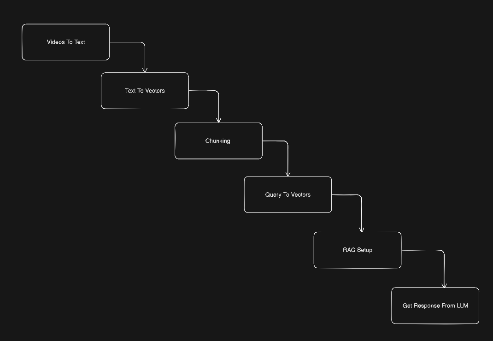
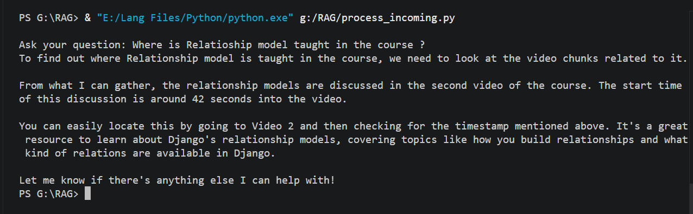

# How to use this RAG AI Teaching Assistant on your own data

This project allows you to build a Retrieval-Augmented Generation (RAG) system over your own course videos. It transcribes the videos, converts the text into vector embeddings, and uses a local LLM to answer questions by pointing you to the exact video and timestamp where the topic is taught. 

## System Architecture / Pipeline

---

## Step 1: Collect your videos
First, gather the data. Move all your raw video files (like `.mp4` or `.mkv`) into the `videos` directory.

## Step 2: Convert to mp3
Convert all the video files to audio formats by running `Video_to_mp3.py`.

**Technical details:** This script loops through your `videos` folder and uses Python's `subprocess` module to trigger `ffmpeg`. It extracts the audio track from each video and saves it as a `.mp3` file in the `Audios` folder. 

## Step 3: Convert mp3 to json (Transcription)
Convert all the extracted mp3 files into structured JSON data by running `mp3_to_json.py`.

**Technical details:** This step uses OpenAI's `whisper` model (specifically the `large-v2` model). It processes each audio file to transcribe the speech (currently set to handle Hindi audio `language='hi'` with a `translate` task). It breaks the audio down into segments, capturing the exact `start` and `end` timestamps for every spoken phrase, and saves this metadata as `.json` files in the `jsons` folder.

## Step 4: Convert the json files to vectors
Use the `preprocess_json.py` file to convert the text chunks from your JSON files into vector embeddings and save them for fast retrieval.

**Technical details:** This script reads all the JSON files and sends the text chunks to a local Ollama instance running the `bge-m3` embedding model via an API request. It maps the returned high-dimensional embeddings to their respective text chunks, video numbers, and chunk IDs. Finally, it structures all of this data into a `pandas` DataFrame and serializes it to your disk as `embeddings.joblib` using the `joblib` library.

## Step 5: Prompt generation and feeding to LLM
Read the joblib file, load it into memory, and start querying your data by running `process_incoming.py`.

**Technical details:** When you ask a question, the script converts your query into an embedding using the same `bge-m3` model. It then uses `cosine_similarity` from `scikit-learn` to compare your question's vector against all the chunks in your database, fetching the top 5 most relevant matches. 

These top matches are then injected into a custom prompt template alongside your original question. This prompt is fed to a local LLM via Ollama (like `llama3.2` or `deepseek-r1`). The LLM is strictly instructed to act as a human teaching assistant, convert raw seconds into a readable minutes/seconds format, and tell you exactly which video and timestamp to check for your answer!

---

## Sample Output
